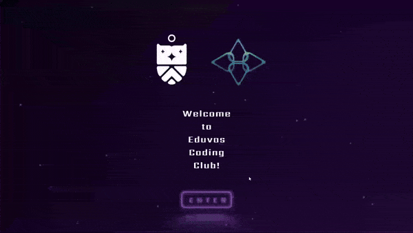
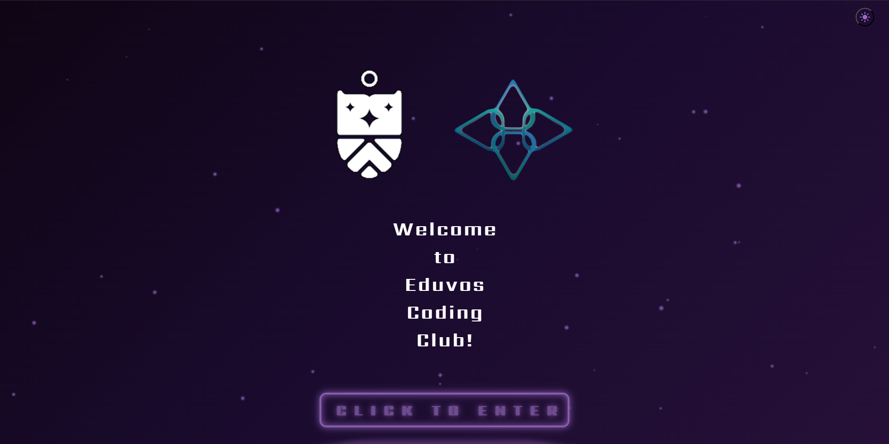
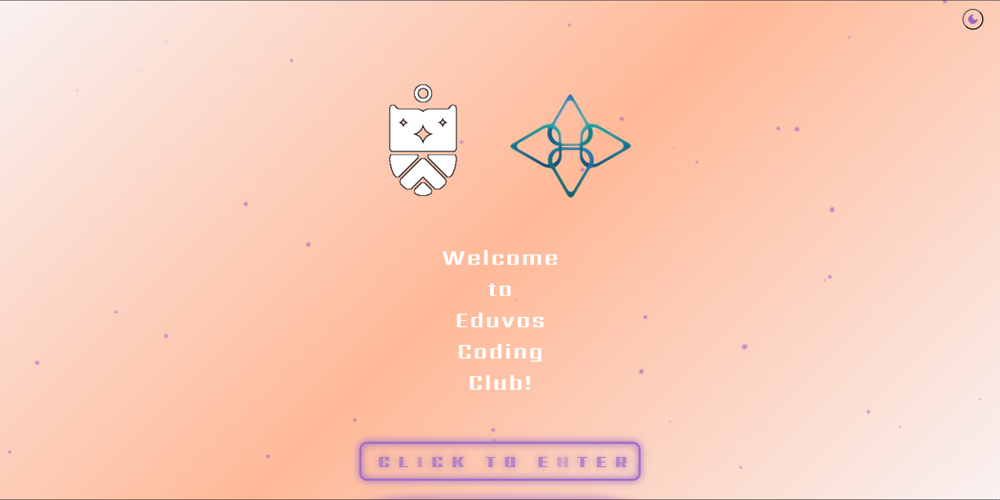
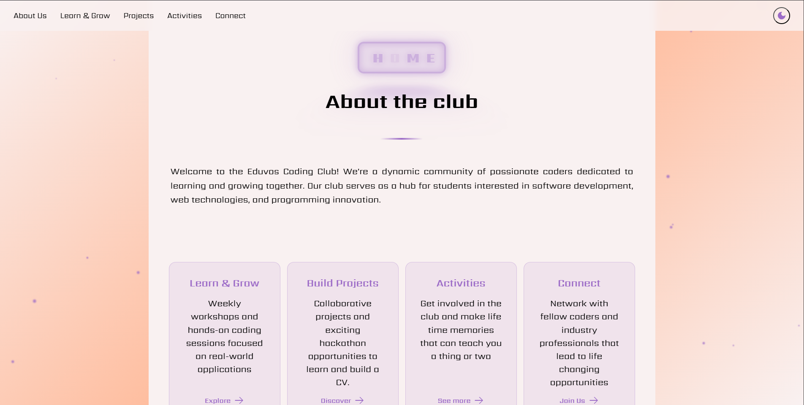

# 🚀 Eduvos Coding Club Website - Hackathon Project

<p align="center">
  
  <br>
  <em>Building Community Through Code</em>
</p>

## ✨ Demo Preview -- <a href="https://peterbredell.github.io/CodingClubFrontPage/" target="__blank">Live Demo Here</p>
<div align="center">
      
</div>

## 🎯 Project Overview
An interactive website for the Eduvos Coding Club featuring:
- 🌟 Dynamic animations and transitions
- 🎨 Modern, responsive design with light/dark theme
- 🔄 Interactive carousel for team members
- ✨ Particle effects background
- 🔗 LinkedIn integration
- 📱 Mobile-friendly interface
- 🎭 Smooth theme switching with persistence
- 📦 Enhanced activity cards layout
- 🎬 Animated header transitions

## 🛠️ Built With
- HTML5
- CSS3 (with animations)
- Vanilla JavaScript
- No frameworks - Pure coding challenge!

## 🌈 Key Features
- **Interactive Welcome Page**
  - Custom particle system
  - Animated text effects
  - Smooth transitions
  - Persistent theme selection

- **Dynamic Navigation**
  - Smart scrolling behavior
  - Floating home button
  - Smooth section transitions
  - Animated header entry/exit

- **Enhanced Activities Section**
  - Full-width activity cards
  - Dynamic content layout
  - Responsive image placement
  - Improved readability

- **Team Showcase**
  - Auto-scrolling carousel
  - LinkedIn profile integration
  - Professional member cards
  - Touch-enabled navigation

## 🎨 Design Highlights
- Custom glowing button effects
- Responsive card layouts
- Dynamic color schemes
- Smooth animations
- Professional typography

## 🚀 Quick Start
1. Clone the repository
```bash
git clone https://github.com/yourusername/eduvos-coding-club
```
2. Open index.html in your browser
3. No build process required!

## 💡 Hackathon Learning Outcomes
- Mastered CSS animations and transitions
- Implemented complex JavaScript functionality
- Created responsive layouts without frameworks
- Built professional UI/UX components
- Developed team showcase features

## 💡 Latest Updates
- Added smooth header animations
- Implemented persistent theme switching
- Enhanced activity cards layout
- Improved mobile responsiveness
- Added touch navigation for carousel
- Fixed transition timing issues
- Optimized content layout

## 👥 Bazinga Team Members
- Peter Bredell EDUV8229212
- Kgothatso Mamabolo  EDUV9052968
- Nogoni Simelane EDUV9143165

## 📸 Screenshots
<p align="center">   </p>
<p align="center">   </p>

## 🔮 Future Improvements
- <input disabled="" type="checkbox"> Add user authentication
- <input disabled="" type="checkbox"> Implement event registration
- <input disabled="" type="checkbox"> Create member dashboard
- <input disabled="" type="checkbox"> Add project submission system
- <input disabled="" type="checkbox"> Optimize 2000 lines of css 

## 🤝 Contributing
Feel free to:

1. Fork the repository
2. Create a feature branch
3. Submit a pull request

## 📝 License
This project is licensed under the MIT License - see the LICENSE file for details

## 🏆 Hackathon Achievement
Built in 5 days for the Coding Club hackathon with focus on creating the face of the coding club and learning as much as possible.
